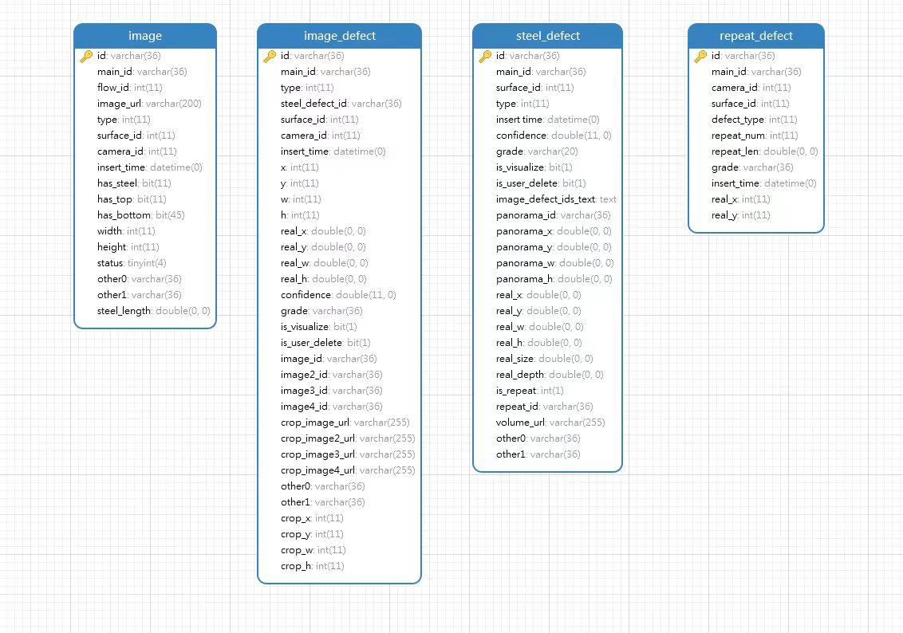
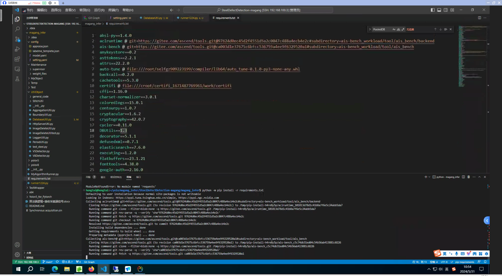

# 202405马钢算法部署

## 准备工作
### 数据库——韩老师
需要提供最新的数据库结构

目前数据库结构如下（20240530）

### 前端客户端——马老师
C#

### 采集端
C++ 对接接口

## 算法端

## 环境部署
cd 到magang_infer目录下

sudo python -m pip install -r requirements.txt

## 模型训练

使用浪潮服务器进行训练

### 收集数据

着重收集了漏清数据（出现较少）

### 数据清洗

首先过滤一遍下载的数据，是否有不清晰的，可以提前滤除

### 数据标注

1、和标注公司联系，进行数据标注（晶云公司）
2、使用智和平台标注

## 业务逻辑

### 修改config/setting.yaml
- model_path 修改为最新模型路径
- data_root 修改为图片存储路径
- image_h image_w 修改为图片宽高
- Database修改es数据库和mysql数据库的ip和端口链接密码
- 修改  process_num gpu_count为核心数目【gpuinfo查询核心数量】
- 修改typeid_chinese【前端决定】、a_label、type_trans_a2c【训练模型时的yaml顺序与前端决定的对应关系】、typeid_label【前端决定】为当前项目的检测类
- Conclusion聚合相关
- unit单元释义
### 修改appraise.json并同步修改到mysql
- mysql-

### 修改/magang_infer/MyObject/ProjectConfig.py
self.appraise_path = os.path.join(parent_dir, 'config', 'appraise_new.json')
appraise_new.json——>为自己项目的评级文件appraise_mg.json

### supervisord文件
> 修改supervisord.conf 路径
> 
> 使用supervisord -c supervisord.conf启动supervisor服务
> 
> supervisorctl status        //查看所有进程的状态
> 
> supervisorctl update        //配置文件修改后使用该命令加载新的配置1
> 
> supervisorctl reload        //重新启动配置中的所有程序2
> 
> supervisorctl stop all	
> 
> supervisorctl -c supervisord.conf restart run(任务名)  restart、stop
> 
> supervisord -c supervisord.conf 指定配置文件运行。
> 
> ps aux | grep supervisor 查看是否启动supervisor

### 使用测试数据模拟批次进行测试

/Test/http_send_mainid.py
修改内部的es、mysql 的ip和端口

找到一个可以用作测试的图片路径，然后发送测试。
